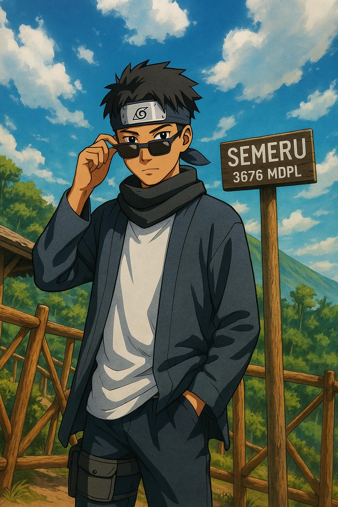

# 👨‍💻 Raihan Fahrel Akbar  
**Mahasiswa Teknik Informatika | UIN Maulana Malik Ibrahim Malang**  

  

---

## 🌟 Tentang Saya  

Halo! Saya **Farel**, seorang mahasiswa aktif di UIN Maulana Malik Ibrahim Malang dengan jurusan **Teknik Informatika**. Passion saya:  

🎮 Game Development  
💻 Web Programming  
🎨 UI/UX Design  

🔭 Sedang membangun: Game HTML5  
🌱 Belajar: React & Mobile Dev  

---

## 🛠 Teknologi  

## 📈 Statistik GitHub  

  
  

  

---

## 🎮 Projek Unik  
### 1. Game Pasangan Interaktif  

**[→ Lihat Projek](https://rafa231206.github.io/SkyboundLovers/)**

---

## 📫 Kontak  

  
  
  

  

<picture>
  <source media="(prefers-color-scheme: dark)" srcset="https://raw.githubusercontent.com/rafa231206/rafa231206/output/pacman-contribution-graph-dark.svg">
  <source media="(prefers-color-scheme: light)" srcset="https://raw.githubusercontent.com/rafa231206/rafa231206/output/pacman-contribution-graph.svg">
  
</picture>

